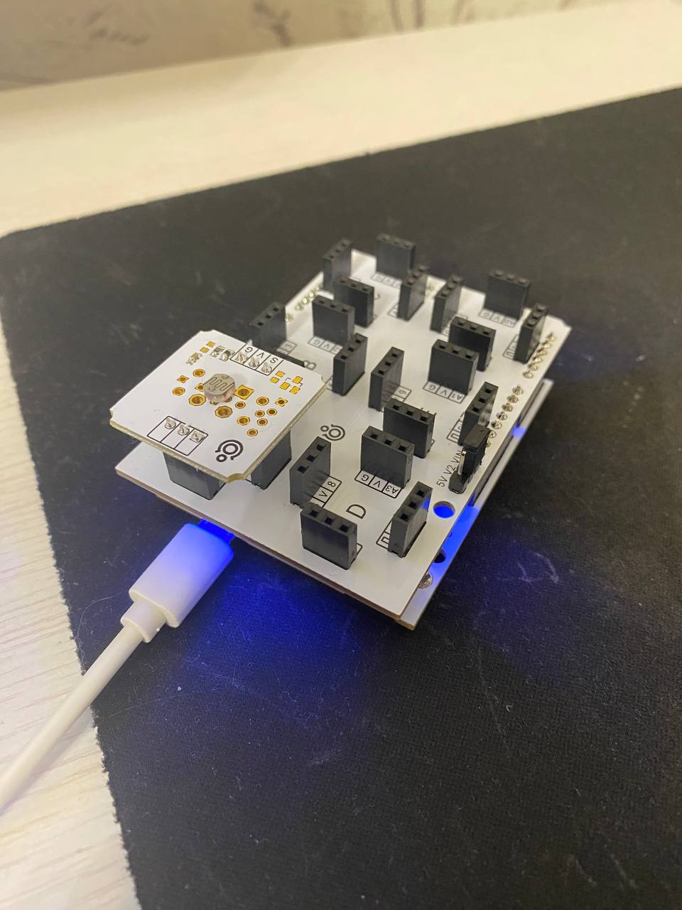

### ДЗ-4 ПС Кабаков

Никогда не работал платами по типу Arduino,
поэтому решил попробовать считать данные с сенсора
на подобной плате.

В магазине электроники купил российский аналог
Arduino - Iskra Neo. К ней купил щиток для легкого
крепления датчиков и датчик освещенности.

Для прошивки платы использовал Arduino IDE.

    

Написал простую программу для отправки данных с платы на аналоге C++ для плат.
Далее написал простую программу для приема данных на Python.
Для передачи данных взял пакет SerialTransfer, который имеет
Python библиотеку и аналогичную для платы на C++.

Для работы с сенсором можно не использовать никакую библиотеку,
но чтобы сразу на плате преобразовать относительные показатели с датчика
в абсолютные люмены взял пакет TroykaLight от производителя датчиков.

В итоге записал порядка 40 секунд непрерывного считывания
освещенности в люменах. Периодически закрывал датчик рукой, плавно и резко.
Как мы видим, освещенность в комнате была в районе 23-25 люмен.
Естественного освещения в комнате не было, фото было сделано в это время.